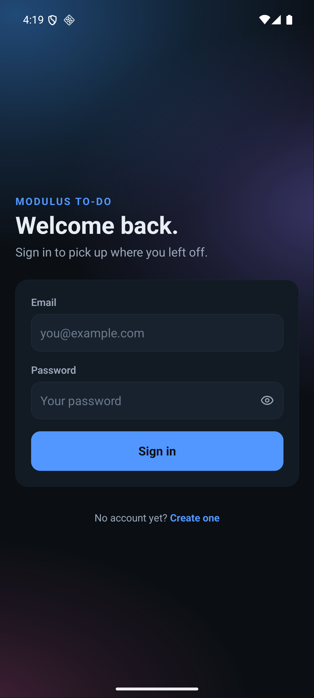
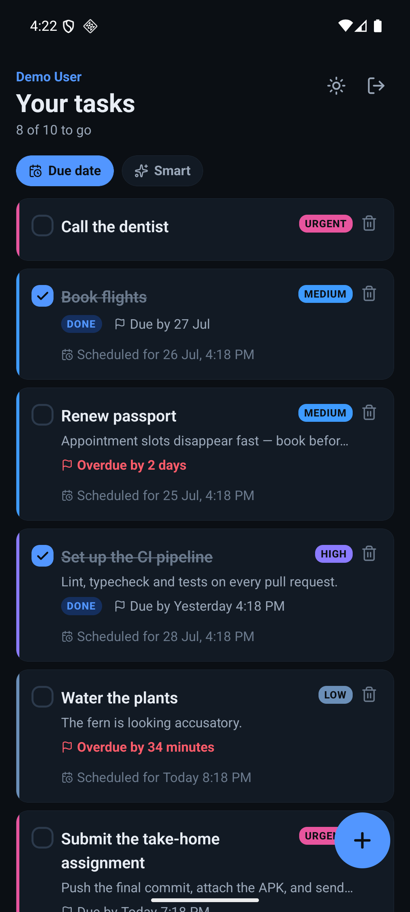
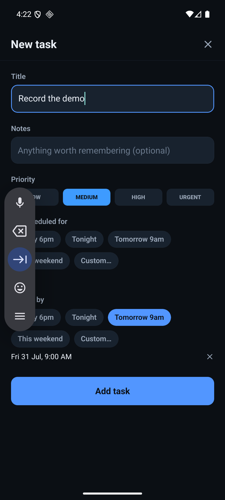
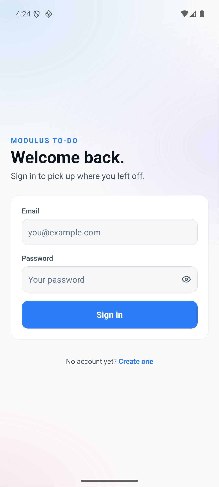
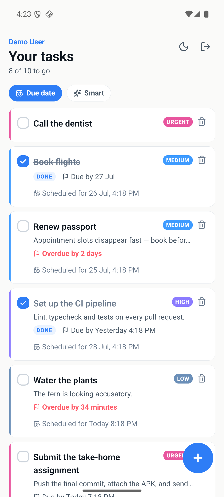
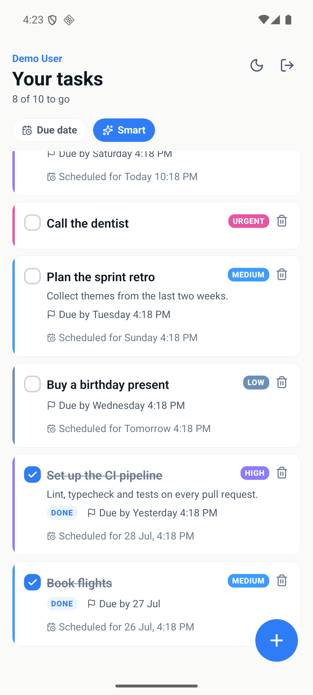

# Modulus To-Do

An Android to-do app built with **React Native CLI + TypeScript**, backed by a **NestJS + MongoDB**
API. Tasks carry a title, description, scheduled date-time, deadline and priority, and can be
sorted by a transparent urgency score that blends all three time/priority signals.

> Assignment submission for **Modulus Seventeen**.

---

## ⏱️ Evaluate this in 5 minutes

|                            |                                                                                                                                                                            |
| -------------------------- | -------------------------------------------------------------------------------------------------------------------------------------------------------------------------- |
| 📱 **Install the app**     | **[Download the signed APK](https://github.com/jatinbansal686/modulus-todo-app/releases/download/v1.0.0/modulus-todo-v1.0.0.apk)** (32 MB · `arm64-v8a` · minSdk 24)       |
| 🔑 **Demo account**        | `demo@modulusseventeen.com` · `ModulusDemo2026!`                                                                                                                           |
| 🌐 **API docs (Swagger)**  | **https://modulus-todo-api.onrender.com/docs**                                                                                                                             |
| ❤️ **API health**          | **https://modulus-todo-api.onrender.com/health**                                                                                                                           |
| 🔄 **Reset the demo data** | `POST https://modulus-todo-api.onrender.com/api/v1/demo/reset`                                                                                                             |
| 🎬 **85-second demo**      | **[Watch the demo](https://github.com/jatinbansal686/modulus-todo-app/releases/download/v1.0.0/modulus-todo-demo.mp4)** — also in-repo at [`docs/demo.mp4`](docs/demo.mp4) |

> ⚠️ **The API is on a free tier and sleeps after 15 minutes idle.** The first request can take
> up to a minute while it wakes up (a recent cold start measured 33 seconds). Everything is
> instant after that — this is a hosting-tier characteristic, not a bug in the app.

**Three things worth trying**

1. Create a task with both a **"Scheduled for"** time and a **"Due by"** deadline, then switch the
   list to **Smart** sort and watch it reorder.
2. Mark something complete — the status changes in place, optimistically, before the server replies.
3. Force-quit the app and reopen it. You stay signed in; the session is restored from the device
   keystore, not from a token sitting in plain storage.

---

## Using the app

### 1. Install it

Download **[modulus-todo-v1.0.0.apk](https://github.com/jatinbansal686/modulus-todo-app/releases/download/v1.0.0/modulus-todo-v1.0.0.apk)** onto an Android phone or emulator (Android 7.0 / API 24 or newer, `arm64-v8a`).

Android will warn about installing an app from outside the Play Store — that warning is expected for any APK shared directly. Allow it for your browser or file manager, or install over a cable:

```bash
adb install modulus-todo-v1.0.0.apk
```

### 2. Sign in

Use the seeded demo account — it already contains ten tasks chosen so the **Smart** sort visibly reorders them:

|              |                             |
| ------------ | --------------------------- |
| **Email**    | `demo@modulusseventeen.com` |
| **Password** | `ModulusDemo2026!`          |

Or tap **Create one** on the sign-in screen to register a fresh account. Registering signs you straight in — there's no "now go and log in" step.

> The very first sign-in may take up to a minute while the free-tier server wakes up. If it times out, the app says _"The server is waking up"_ — just tap **Sign in** again.

### 3. What each screen does

**Task list** — everything you own, ordered by deadline.

| To do this         | Do that                                                                                             |
| ------------------ | --------------------------------------------------------------------------------------------------- |
| Add a task         | Tap the blue **+** button, bottom right                                                             |
| Mark one done      | Tap its checkbox — it updates immediately, and the title gets a line through it plus a `DONE` badge |
| Edit one           | Tap anywhere on the task's body                                                                     |
| Delete one         | Tap the bin icon on the right, then confirm                                                         |
| Reorder by urgency | Tap **Smart** at the top (**Due date** switches back)                                               |
| Refresh            | Pull down on the list                                                                               |
| Switch light/dark  | Tap the sun/moon icon, top right                                                                    |
| Sign out           | Tap the exit icon, top right                                                                        |

**New task / Edit task** — the same screen for both.

| Field             | Notes                                                                  |
| ----------------- | ---------------------------------------------------------------------- |
| **Title**         | The only required field                                                |
| **Notes**         | Optional longer description                                            |
| **Priority**      | LOW · MEDIUM · HIGH · URGENT — feeds the Smart sort                    |
| **Scheduled for** | When you intend to _work on_ it                                        |
| **Due by**        | When it becomes _late_ — this is what drives the red "Overdue" warning |

For both dates, tap a chip — **Today 6pm**, **Tonight**, **Tomorrow 9am**, **This weekend** — to set it in one tap, or **Custom…** to pick any date and time. Tap the **✕** beside a chosen date to clear it.

### 4. One more thing to try

Turn off wi-fi and pull down to refresh. You get a designed error screen naming what went
wrong — not a blank list, which would be indistinguishable from having no tasks.

(The three headline things to try are listed above, under _Evaluate this in 5 minutes_.)

### 5. Starting over

To restore the demo account to its original ten tasks at any point:

```bash
curl -X POST https://modulus-todo-api.onrender.com/api/v1/demo/reset
```

---

## Screenshots

|                                                                     |                                                                             |                                                                                    |
| :-----------------------------------------------------------------: | :-------------------------------------------------------------------------: | :--------------------------------------------------------------------------------: |
|  <br>Login — dark   |  <br>Task list — dark   |     <br>Composer — dark      |
| <br>Login — light | <br>Task list — light | <br>Smart sort — light |

---

## Features

Mapped to the brief's requirements, so they're easy to tick off.

**Functional requirements**

| Requirement                                                    | What's implemented                                                                                                                                                                                                | Where                                                             |
| -------------------------------------------------------------- | ----------------------------------------------------------------------------------------------------------------------------------------------------------------------------------------------------------------- | ----------------------------------------------------------------- |
| Email/password authentication                                  | Register + login screens (`react-hook-form` + `zod` validation), JWT access token (15 min) + opaque refresh token (30 days), session restored from the device Keychain on cold start                              | `apps/mobile/src/features/auth/`, `apps/api/src/modules/auth/`    |
| Task fields: title, description, date-time, deadline, priority | All five in one composer screen for create and edit. "Date-time" and "deadline" are the deliberately distinct `scheduledAt` / `dueAt` fields, labelled "Scheduled for" and "Due by" so the two can't be conflated | `apps/mobile/src/features/tasks/screens/task-composer-screen.tsx` |
| View a list of tasks with status                               | Task list screen; an explicit TODO/DONE pill plus a strikethrough title, not just a checkbox                                                                                                                      | `apps/mobile/src/features/tasks/screens/task-list-screen.tsx`     |
| Create, edit, delete                                           | Full CRUD. Delete is soft (`deletedAt`) with a restore endpoint already in place server- and client-side                                                                                                          | `apps/api/src/modules/tasks/tasks.controller.ts`                  |
| Mark complete / incomplete                                     | One-tap, optimistic toggle — the row updates before the server replies                                                                                                                                            | `POST /tasks/:id/toggle`                                          |
| Code comments explaining important sections                    | Every file with a non-obvious decision carries a comment on _why_, not just _what_; `eslint-plugin-jsdoc` guards several of those comments against drifting out of sync with the code                             | throughout — see "Design decisions" below                         |

**Bonus features**

| What                   | Where                                                                                                                                                                                 |
| ---------------------- | ------------------------------------------------------------------------------------------------------------------------------------------------------------------------------------- |
| Categories/tags        | `tags: string[]` on every task, end to end in the API and the mobile `Task` type (no UI to set or filter by one yet — see "What I'd do next")                                         |
| Smart urgency sort     | The whole of the next section                                                                                                                                                         |
| "Cool and creative" UI | Full dark + light themes, a hue-walk priority ramp instead of traffic lights, an SVG aurora backdrop on the auth screens, designed loading/empty/error states — see `docs/ui-spec.md` |

**Rubric crosswalk**

| Rubric line         | Look at                                                                                                                                                                     |
| ------------------- | --------------------------------------------------------------------------------------------------------------------------------------------------------------------------- |
| Correctness         | The functional table above; 53 API e2e tests exercise it against a real in-memory MongoDB, not a mocked repository                                                          |
| Code Quality        | The explanatory comments described above; one error envelope for every failure; one RTK Query slice rather than one per feature                                             |
| User Interface      | `docs/ui-spec.md`; screenshots above                                                                                                                                        |
| State Management    | One RTK Query API slice, tag-based invalidation, optimistic updates — see "Architecture" and `docs/architecture.md`                                                         |
| Authentication Flow | Three-state auth machine, mutex-serialised token refresh, access/refresh tokens deliberately stored in different places — see "Design decisions" and `docs/architecture.md` |
| Bonus Features      | Smart sort, tags, the UI treatment above                                                                                                                                    |

---

## Smart sort

The list has two orders: the server's default (`dueAt` ascending) and **Smart**, a client-side
urgency score in `[0, 1]` that blends priority, deadline proximity, schedule proximity and how
overdue a task is — so a LOW-priority chore due in an hour doesn't automatically outrank an
URGENT task due tomorrow.

| Term     | Weight | What it measures                                                                                                                                |
| -------- | ------ | ----------------------------------------------------------------------------------------------------------------------------------------------- |
| Priority | 0.40   | LOW 0.25 · MEDIUM 0.50 · HIGH 0.75 · URGENT 1.00                                                                                                |
| Deadline | 0.30   | Linear proximity to `dueAt`, decaying over a 72-hour horizon; saturates at 1.0 once the deadline has passed                                     |
| Schedule | 0.15   | Linear proximity to `scheduledAt`, decaying over a 24-hour horizon; also saturates at 1.0 once past                                             |
| Overdue  | 0.15   | `log1p` of days late, saturating at 7 days — so the difference between one day late and two matters far more than between thirty and thirty-one |

The weights sum to exactly 1.0, which is asserted in the test suite. An earlier draft used
0.45/0.35/0.20/0.10 — which sums to 1.10 — so an overdue URGENT task could have scored above
100%, on exactly the demo's hero case.

**Worked example.** Take a HIGH-priority task that's scheduled 6 hours from now and was due 10
hours ago, scored at this instant:

| Term            | Raw score | Working                                                              | × weight | =          |
| --------------- | --------- | -------------------------------------------------------------------- | -------- | ---------- |
| Priority (HIGH) | 0.7500    | fixed table lookup                                                   | 0.40     | 0.3000     |
| Deadline        | 1.0000    | already due, so proximity saturates at 1 regardless of _how_ overdue | 0.30     | 0.3000     |
| Schedule        | 0.7500    | `1 − 6⁄24` (6 hours into a 24-hour horizon)                          | 0.15     | 0.1125     |
| Overdue         | 0.1675    | `log1p(10⁄24) ÷ log1p(7)` = `log1p(0.417) ÷ log1p(7)`                | 0.15     | 0.0251     |
| **Total**       |           |                                                                      |          | **0.7376** |

Sorted, most urgent first, with completed tasks always sinking to the bottom regardless of
score, and ties broken on task id so the order never shuffles for no visible reason on a re-render.

The formula is client-side only, deliberately not mirrored as a MongoDB aggregation: `$divide`
throws on zero where JavaScript returns `Infinity`, there's no `$log1p`, and `$round` uses
banker's rounding where `Math.round` doesn't — two implementations would only be two chances to
disagree. The API keeps sorting by `dueAt` for stable pagination; "Smart" re-sorts the page
already loaded.

Full formula, weights and worked-example properties: `apps/mobile/src/features/tasks/model/urgency.ts`.

---

## Architecture

Two independent projects in one repository — `apps/api` (NestJS + Mongoose) and `apps/mobile`
(React Native CLI) — rather than an npm workspace: nothing is genuinely shared between them
(React Native cannot consume the API's `class-validator`-decorated DTOs anyway), so workspace
hoisting would solve a problem that doesn't exist here.

The full request flow, the token-refresh lifecycle (with a sequence diagram), the data model and
its indexes, state-management conventions and the error contract are written up in
**[`docs/architecture.md`](docs/architecture.md)**.

---

## Running it locally

### Requirements

- **Node 22.18.0** (see `.nvmrc`)
- **JDK 17** exactly — React Native 0.86's Android Gradle Plugin does not support newer JDKs
- **Android SDK 36** + NDK `27.1.12297006`, plus an emulator or a connected device
- **MongoDB**, local or Atlas

`./scripts/setup-android.sh` provisions JDK 17, the SDK, the matching NDK, an AVD and a local
MongoDB on macOS (Apple Silicon) in one pass — it's the script that actually set up the
development machine this was built on, not a reconstruction.

### API

```bash
cd apps/api
cp .env.example .env   # fill in MONGODB_URI and three 32+ character secrets
npm install
npm run start:dev      # http://localhost:3000 — Swagger at /docs
```

Every value in `.env` is validated at boot (Joi, `abortEarly: false`), so a misconfigured
environment fails immediately with the complete list of problems rather than failing later on
the first request. Once it's running, `POST http://localhost:3000/api/v1/demo/reset` seeds the
same demo account and ten relatively-dated tasks against your local database.

### Mobile

```bash
cd apps/mobile
npm install
npm run android   # builds, installs and launches on a connected device/emulator
```

The emulator can't reach `localhost` — `src/shared/config/env.ts` points debug builds at
`10.0.2.2:3000` instead. On a physical device over USB, run `adb reverse tcp:3000 tcp:3000` and
it resolves the same way. To point a debug build at the hosted API instead of a local one, edit
`DEV_API_URL` in `env.ts` and reload the bundle — no rebuild needed, since it's plain JavaScript.

---

## Testing

```bash
cd apps/mobile && npx jest         # 203 tests / 17 suites
cd apps/api && npm run test:e2e    # 53 tests / 4 suites
```

The API has no separate unit-test layer — every check (`auth`, `tasks`, `indexes`, `foundation`)
runs as an end-to-end test against a real, in-memory MongoDB via `mongodb-memory-server`,
exercising the actual Mongoose schemas, indexes and validation rather than a mocked repository.

Coverage is collected for the mobile suite (`test:ci` runs with `--coverage`) and reported, never
gated — a coverage threshold fails a build for a reason unrelated to correctness, usually at the
worst possible moment.

CI (`.github/workflows/ci-api.yml`, `ci-mobile.yml`) runs lint, typecheck and tests on every pull
request against both apps independently; an Android debug APK is built after merge rather than on
the pull request itself, since a cold React Native Android build is 8–15 minutes and would gate
every review.

---

## Design decisions

The contested calls, and the reasoning behind each:

| Decision                                                                                                                          | Reasoning                                                                                                                                                                                                                                                                                                                            |
| --------------------------------------------------------------------------------------------------------------------------------- | ------------------------------------------------------------------------------------------------------------------------------------------------------------------------------------------------------------------------------------------------------------------------------------------------------------------------------------ |
| Smart-sort weights sum to exactly 1.0 (0.40 / 0.30 / 0.15 / 0.15)                                                                 | So the score is provably in `[0, 1]`, which is asserted in the test suite. An earlier 0.45/0.35/0.20/0.10 draft summed to 1.10, letting an overdue URGENT task's score exceed 100%.                                                                                                                                                  |
| Session refresh is a mutex-serialised `401 → refresh → retry`, and the refresh request itself bypasses RTK Query                  | Several queries can expire at once; without a lock, each starts its own refresh, and once rotation ships a second refresh reads as token theft. The refresh uses a plain `fetch` because routing the repair through the transport it's repairing recurses until the stack gives out. See `apps/mobile/src/shared/api/base-query.ts`. |
| Access token lives in memory (Redux) only; refresh token lives in the OS Keychain only, never in Redux                            | The access token dies with the process by design — nothing to recover from a rooted device or a bug-report state dump. The refresh token is the long-lived credential and lives where the OS actually protects it.                                                                                                                   |
| Auth status is a three-state machine (`bootstrapping` / `authenticated` / `anonymous`), not a boolean                             | The Keychain read is asynchronous, so on cold start the app genuinely doesn't know yet whether anyone is signed in. A boolean forces that unknown to be guessed as `false`, flashing the login screen on every launch for a returning user.                                                                                          |
| Complete and delete are optimistic via `selectInvalidatedBy`, not `updateQueryData(endpoint, undefined, …)`                       | The latter targets one exact cache entry by its fetch arguments; hardcoding `undefined` is the classic RTK Query bug where the visible list never updates because it was actually fetched with different arguments. `selectInvalidatedBy` patches every cache entry that genuinely holds the tag.                                    |
| `scheduledAt` and `dueAt` stay separate fields end to end, and a row's countdown reads only from `dueAt`                          | The brief names "date-time" and "deadline" separately, and people conflate them anyway. The UI answers it in the labels ("Scheduled for" vs "Due by") instead of hoping a grader infers it.                                                                                                                                          |
| Passwords hashed with Argon2id at OWASP's documented floor (19 MiB, t=2, p=1), kept even on a 0.1-CPU free tier                   | bcrypt is "legacy systems only" per current OWASP guidance and silently truncates at 72 bytes. Weakening the KDF to make a free tier feel faster is the wrong trade; the slower login is instead named plainly in `docs/deployment.md`.                                                                                              |
| JWT verification pins the algorithm to `HS256`                                                                                    | Without pinning, a verifier can be talked into accepting `alg: none` or an algorithm-confusion attack.                                                                                                                                                                                                                               |
| Auth failures use distinct sub-codes (`AUTH_TOKEN_EXPIRED` vs `AUTH_TOKEN_INVALID` vs `AUTH_CREDENTIALS_INVALID`), not a bare 401 | The client branches on these. One undifferentiated 401 makes it either loop forever refreshing a malformed token, or sign someone out over a token that had merely expired.                                                                                                                                                          |
| Request timeout is implemented by hand in `fetch-with-timeout.ts`, not via `fetchBaseQuery({ timeout })`                          | RTK Query's own timeout never clears its internal `setTimeout`, which is harmless in the running app but leaves a live timer under Jest on every request — the classic "Jest did not exit" warning, and a 30-second tax on every CI run.                                                                                             |

---

## What I'd do next

Cut deliberately, for reasons of time rather than difficulty:

- **Refresh-token rotation + reuse detection.** The schema already carries `familyId`,
  `replacedByTokenHash` and a `revokeFamily` method, and the mobile client already treats
  `AUTH_REFRESH_REUSED` as a terminal, hard-logout code — but the server currently echoes the
  same refresh token back unrotated, so that branch can't actually fire yet. Wiring rotation
  through is the remaining work.
- **Swipe-to-delete with undo.** The server-side restore (`POST /tasks/:id/restore`) and the
  client's `useRestoreTaskMutation` both already exist and are tested; only the swipe gesture and
  an undo snackbar are missing.
- **Filters and tags in the UI.** `tags: string[]` and a `tag` query filter exist end to end in
  the API and the mobile `Task` type, but nothing in the app lets you set or filter by one yet.
- **Offline caching.** The RTK Query cache is deliberately not persisted — per Redux's own
  guidance, a stale cache restored from disk is worse than a refetch — so there's no offline read
  path at all right now.
- **The SVG urgency ring.** `docs/ui-spec.md` specifies a continuous ring that interpolates the
  priority ramp's hue walk over the 0–1 urgency score; the row currently shows a flat 3px
  priority-colour rail instead (the geometry already matches, so the upgrade is a colour change,
  not a layout change).
- **Infinite scroll.** The API paginates (`page`/`limit`, capped at 100 per request); the list
  screen fetches a single page. Fine for ten seeded demo tasks, not for a real list.
- **Search.** There's no `$text` index — it matches whole stemmed terms, so typing "gro" wouldn't
  find "groceries". A client-side filter over the loaded page is the planned answer, not a text
  index.
- **Maestro end-to-end tests.** Everything below the UI is covered (203 mobile tests, 53 API e2e
  tests), and the signed release APK was driven end to end by hand on an API-36 emulator before
  this release — but no _automated_ suite exercises the compiled app, so that check is a manual
  step today rather than a gate.
- **Harden the Atlas network path.** It's currently open to `0.0.0.0/0` because Render's free
  tier has no static outbound IP range to allowlist instead. What actually protects the database
  is SCRAM authentication plus a user scoped to one database — VPC peering is the real production
  answer; see `docs/deployment.md` for the full reasoning.

---

## Contributing conventions

- **Conventional Commits v1.0.0, single line.** `feat(tasks): add urgency-based smart sorting`
- **One branch per unit of work**, merged via squash-merge into a protected `main`.
- Enforced by a husky `commit-msg` hook locally and a `commitlint` job in CI.

## License

MIT — see [LICENSE](LICENSE).
